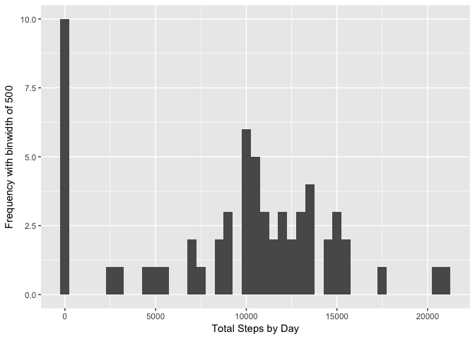
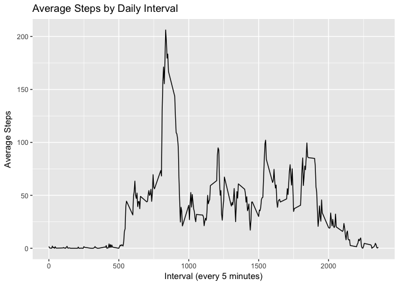
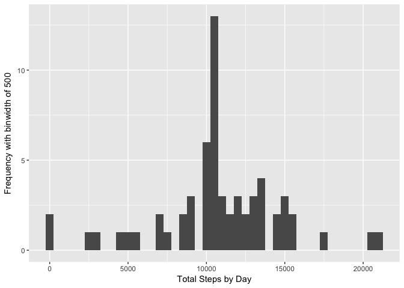
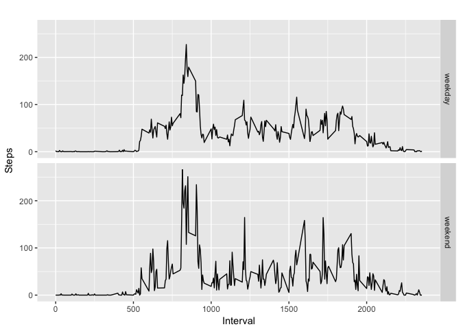

# Reproducible Research: Peer Assessment 1


```r
library(knitr)
```

```
## Warning: package 'knitr' was built under R version 3.3.2
```

```r
opts_chunk$set(fig.path='figure/') # Store the figures in the figures/ folder
```

## Introduction
Author: Chris Drumgoole / https://github.com/cdrum/RepData_PeerAssessment1 / December 2016

This document will include the following:  

1. Code for reading in the dataset and/or processing the data [Yes]
2. Histogram of the total number of steps taken each day [Yes]
3. Mean and median number of steps taken each day [Yes]
4. Time series plot of the average number of steps taken [Yes]
5. The 5-minute interval that, on average, contains the maximum number of steps [Yes]
6. Code to describe and show a strategy for imputing missing data [Yes]
7. Histogram of the total number of steps taken each day after missing values are imputed [Yes]
8. Panel plot comparing the average number of steps taken per 5-minute interval across weekdays and [Yes]
9. weekends [Yes]
10. All of the R code needed to reproduce the results (numbers, plots, etc.) in the report [Yes]

## Loading and preprocessing the data

First thing we need ot do is create the data folder and unzip the 'activity.zip' file to the data folder.


```r
if(!file.exists("./data")){dir.create("./data")} # Create the Data folder if it doesn't already exist
unzip("./activity.zip", exdir="./data", overwrite = TRUE) # Unzip the data into the data folder
```

Next, let's read the csv file into a data table called **ACTIVITY.DT**.


```r
library(data.table)
```

```
## Warning: package 'data.table' was built under R version 3.3.2
```

```r
ACTIVITY.DT <- data.table(read.csv("./data/activity.csv"))
```

## What is mean total number of steps taken per day?

*We're going to ignore the NA values (missing data) for purposes of this question.*

### Total Steps per Day
First step is to Calculate the total number of steps taken per day. We can do this by creating a key for the data.table using `setkey` function. Next, we can use the handy data.table syntax allowing us to do calculata sum of column `steps` according to the column key we just created. We store this in `steps.by.day`.


```r
setkey(ACTIVITY.DT, date)
steps.by.day <- ACTIVITY.DT[, list(TotalSteps=sum(steps, na.rm = TRUE)), by=key(ACTIVITY.DT)] 
# no.rm = TRUE to ignore NAs and include 0's where there are no values for a day
```

### Total Steps per Day Frequency Histogram

Using ggplot2, we can make a nice histogram plot of the frequency of steps by day.


```r
library(ggplot2)
```

```
## Warning: package 'ggplot2' was built under R version 3.3.2
```

```r
qplot(steps.by.day$TotalSteps, geom="histogram", binwidth=500, xlab = "Total Steps by Day", 
      ylab= "Frequency with binwidth of 500")
```

<!-- -->

### Mean and Median Steps per Day

Finally, what we can do is simply apply the `TotalSteps` column of the sumarized data set `steps.by.day` to the `mean` function. And note that I'm capping the result to 2 decimal places using the `round` function.


```r
final.daily.mean <- round(mean(steps.by.day$TotalSteps, na.rm=TRUE), digits=2)
final.daily.median <- median(steps.by.day$TotalSteps, na.rm=TRUE)
final.daily.mean
```

```
## [1] 9354.23
```

```r
final.daily.median
```

```
## [1] 10395
```

And we can find the mean total number of steps taken per day is **9354.23** and the median is **10395**.  


## What is the average daily activity pattern?

The first thing we want to do to answer this quesiton is to make a time series plot (i.e. `type="l"`) of the 5-minute interval (x-axis) and the average number of steps taken, averaged across all days (y-axis). Since I like `ggplot`, I will be using qplot instead of the base package.

In order to do this, we need to reformat our data a bit. For each time interval, we need to calculate the `mean`. Like with the previous question, we can use some handy `data.table` syntax.

First, let's make the `interval` column a key. Then we can caluclate the mean according to this key grouping.


```r
setkey(ACTIVITY.DT, interval)
mean.steps.by.interval <- ACTIVITY.DT[, list(AverageSteps=mean(steps, na.rm = TRUE)), by=key(ACTIVITY.DT)] 
head(mean.steps.by.interval, 10)
```

```
##     interval AverageSteps
##  1:        0    1.7169811
##  2:        5    0.3396226
##  3:       10    0.1320755
##  4:       15    0.1509434
##  5:       20    0.0754717
##  6:       25    2.0943396
##  7:       30    0.5283019
##  8:       35    0.8679245
##  9:       40    0.0000000
## 10:       45    1.4716981
```

Next, now that we have this data, we can plot it!


```r
qplot(mean.steps.by.interval$interval, mean.steps.by.interval$AverageSteps, geom = "line",
      main="Average Steps by Daily Interval", 
      xlab = "Interval (every 5 minutes)", ylab = "Average Steps")
```

<!-- -->

Next, to answer the question *"Which 5-minute interval, on average across all the days in the dataset, contains the maximum number of steps?"*, we can simply use the `which.max` function to find the row number and then apply it to the data.table to find the interval.


```r
max.interval.index <- which.max(mean.steps.by.interval$AverageSteps)
interval.with.max <- mean.steps.by.interval[max.interval.index]$interval
interval.with.max
```

```
## [1] 835
```

We can finally see that the interval with the maximum average steps is **835**. This corresponds to the highest point on the chart we just plotted.


## Imputing missing values

To avoid any potential for bias, we need to impute any NA value. 

The first step to doing this, we will first calculate and report the total number of missing values in the dataset (i.e. the total number of rows with NAs). To do this, we can simply sum!


```r
total.nas <- sum(is.na(ACTIVITY.DT$steps))
total.nas
```

```
## [1] 2304
```

We see that there are **2304** rows with NA values.

Next, in order to fill those NAs, we need to devise a strategy for filling in all of the missing values in the dataset. The strategy does not need to be sophisticated. For example, you could use the mean/median for that day, or the mean for that 5-minute interval, etc. 

Personally, I like the idea of taking the mean steps by interval across all days. We can make use of the `data.table` we created earlier, `mean.steps.by.interval` data.table. 

Let's create a logical vector telling us what row of the original data set has a NA for steps (we'll call it `na.steps`. We can then, for each NA row (TRUE in the vector), apply the value in `mean.steps.by.interval` into the main data.table. I can accomplish this using mapply and a custom function I make doing the search/replace, leveraging the `dtplyr` function `filter`.

Finally, we can create a new dataset that is equal to the original dataset but with the missing data filled in. This new dataset is called `COMPLETE.ACTIVITY.DT`.


```r
library(dtplyr)
library(dplyr, warn.conflicts = FALSE)
impute.steps <- function(steps, int) {
    return(as.integer(filter(mean.steps.by.interval, interval == int)$AverageSteps))
    # forcing as an integer since our original data table stored integers
}

COMPLETE.ACTIVITY.DT <- ACTIVITY.DT # Copy data.table for imputing
na.steps <- is.na(ACTIVITY.DT$steps) # Find the NA value rows

COMPLETE.ACTIVITY.DT[na.steps]$steps <- mapply(impute.steps, COMPLETE.ACTIVITY.DT[na.steps]$steps,
                                               COMPLETE.ACTIVITY.DT[na.steps]$interval)
```

Sanity check, make sure there are no na values in steps:


```r
sum(is.na(COMPLETE.ACTIVITY.DT$steps))
```

```
## [1] 0
```

**Success!** Finally, let's make a histogram of the total number of steps taken each day and Calculate and report the mean and median total number of steps taken per day. Basically, repeating what we did before for comparison.

### Re-Analysis - Histogram frequency of steps per day and mean/median calculations


```r
options(scipen=999)
library(ggplot2)
setkey(COMPLETE.ACTIVITY.DT, date)

complete.steps.by.day <- COMPLETE.ACTIVITY.DT[, 
                                list(TotalSteps=sum(steps, na.rm = TRUE)), by=key(COMPLETE.ACTIVITY.DT)] 

qplot(complete.steps.by.day$TotalSteps, geom="histogram", binwidth=500, xlab = "Total Steps by Day", 
      ylab= "Frequency with binwidth of 500")
```

<!-- -->

```r
complete.final.daily.mean <- round(mean(complete.steps.by.day$TotalSteps, na.rm=TRUE), digits=2)
complete.final.daily.median <- median(complete.steps.by.day$TotalSteps, na.rm=TRUE)
complete.final.daily.mean
```

```
## [1] 10749.77
```

```r
complete.final.daily.median
```

```
## [1] 10641
```

For this new data set (complete imuted NA values), we find the mean total number of steps taken per day is **10749.77** and the median is **10641**.  

We can see that these new mean/median values are different from the previous ones:

- Mean: **9354.23** *(with NA)* compared with **10749.77** *(imuted)* (Difference of 1395.54)
- Median: **10395** *(with NA)* compared with **10641** *(imuted)* (Difference of 246)

The impact of imputing missing data on the estimates of the total daily number of steps is quite big when looking at the mean values **(over 1,000 higher!)**.

## Are there differences in activity patterns between weekdays and weekends?


weekdays()

For this, we'll continue using our new Imuted dataset, `COMPLETE.ACTIVITY.DT`. 

### Creation of factor variable in dataset

First thing we want to do in our analysis is create a new factor variable in the dataset with two levels – “weekday” and “weekend” indicating whether a given date is a weekday or weekend day.

For this, we can use the `weekdays` function, but first we need to ensure the `date` column in the data set is of `Date` type. We can make a logical vector that stores whether the row is a weekend or not. But, we use `ifelse` to actually apply "weekend" or "weekday" to it (`weekday.or.weekend`). Then we simply add this as a column to the dataset. Finally, transform to create the factor.


```r
COMPLETE.ACTIVITY.DT$date <- as.Date(ACTIVITY.DT$date, "%Y-%m-%d") # Convert to Date type
weekday.or.weekend <- ifelse(weekdays(COMPLETE.ACTIVITY.DT$date) %in% 
                         c("Saturday", "Sunday"), "weekend", "weekday")

COMPLETE.ACTIVITY.DT$day.of.week <- weekday.or.weekend # add new col
COMPLETE.ACTIVITY.DT <- transform(COMPLETE.ACTIVITY.DT, day.of.week = factor(day.of.week))
```

### Plot 

Finally, we make a panel plot containing a time series plot (i.e. type="l") of the 5-minute interval recordings (on the x-axis) and the average number of steps taken at that interval, averaged across all weekday days or weekend days (y-axis) - split into two charts. 

We accomplish this by first recalculating the mean steps by interval, but this time, taking into account the imputed complete data we created earlier, AND calculate based on two groupings -interval and the weekend/weekday factor. (Keep in mind, previously we set the `day.of.week` col as a factor. this is necessary for this to work.)

We can then simply use `ggplot` to plit it, using a `facit_grid` on the `day.of.week` col.


```r
# Create data set for spltting using 2 key variables - interval and day.of.week
complete.mean.steps.by.interval <- COMPLETE.ACTIVITY.DT[, 
                                    list(AverageSteps=mean(steps, na.rm = TRUE)), 
                                    by=list(day.of.week, interval)] 

# Construct the plot
gg <- ggplot(data = complete.mean.steps.by.interval, aes(x = interval, y = AverageSteps)) +
    facet_grid(day.of.week ~ .) + # 2 rows, detemrined by day.of.week factor (weekday or weekend)
    geom_line() +
    ggtitle("") +
    labs(x = "Interval", 
         y = "Steps") 

# Plot it!
gg
```

<!-- -->

And there we have it!
